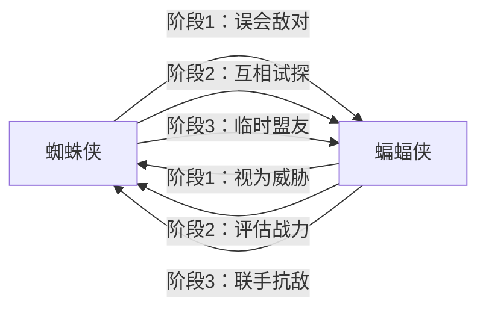

# 角色档案

## 一、核心角色信息表

| 角色     | 蜘蛛侠（彼得·帕克）                                                      | 蝙蝠侠（布鲁斯·韦恩）                                                             |
| -------- | ------------------------------------------------------------------------ | --------------------------------------------------------------------------------- |
| 年龄     | 22岁                                                                     | 35岁                                                                              |
| 身份     | 漫威宇宙纽约守护者，每日号角报摄影师                                     | DC宇宙哥谭义警，韦恩集团董事长                                                    |
| 性格     | 话痨跳脱，正义感极强，坚守"不杀人"底线，偶尔冲动冒进                     | 寡言冷酷，逻辑至上，多疑偏执，为了达成正义目标可以突破规则限制                    |
| 核心能力 | 蜘蛛感应（预判危险）、超强敏捷性、蛛丝发射装置、墙面攀爬能力、30吨级力量 | 人类巅峰格斗术、全套黑科技蝙蝠装备、顶级智商谋略、防弹蝙蝠装甲、各类侦查/作战道具 |
| 弱点     | 对超声波、EMP脉冲敏感，家人（梅婶）是核心软肋                            | 无超能力，体能存在极限，父母死亡的心理创伤易被利用                                |
| 核心目标 | 保护纽约市民不受侵害，查清黑衣男子的身份和城市异变的原因                 | 找到返回哥谭的方法，查清时空重叠的真相，消除潜在威胁                              |

## 二、角色关系图

## 三、角色弧线设计

### 蜘蛛侠弧线

1. 初期：认为所有破坏城市的人都是反派，上来就动手，因为话痨和轻敌吃了不少亏
2. 中期：在连番对决中意识到对方不是单纯的反派，开始主动调查冲突背后的异常，学会收敛冲动，理性分析对手
3. 后期：接受了"正义可以有不同形式"的理念，放下偏见和蝙蝠侠联手，变得更加成熟稳重

### 蝙蝠侠弧线

1. 初期：穿越到陌生城市，将所有未知存在视为潜在威胁，全程不开口说话，只靠装备和格斗术压制对手
2. 中期：发现蜘蛛侠的行为逻辑符合义警特征，开始调查时空重叠的线索，逐渐放下敌意，第一次开口和蜘蛛侠对话
3. 后期：学会信任他人，不再偏执地独自解决所有问题，和蜘蛛侠配合消灭共生体，返回哥谭后不再完全独来独往
