# 《凤还巢》角色档案

## 一、角色总览

| 角色类型 | 数量 | 主要角色                                                           |
| -------- | ---- | ------------------------------------------------------------------ |
| 主角     | 2人  | 沈清欢（苏晚）、萧衍（帝王）                                       |
| 核心配角 | 5人  | 林若烟（贵妃）、太后、沈若兰（姐姐）、周雪宁（闺蜜）、夜影（暗卫） |
| 功能角色 | 4人  | 刘嬷嬷、翠云、林德海（渣爹）、皇后（先帝）                         |
| 临时角色 | 按需 | 各色嫔妃、太监、宫女等                                             |

---

## 二、角色信息表

### 【女主角】沈清欢（原身）/ 苏晚（现代）

| 字段         | 内容                                                                                                       |
| ------------ | ---------------------------------------------------------------------------------------------------------- |
| **角色名称** | 沈清欢（原名）/ 苏晚（现代名） 别称：冷宫弃妃、穿越娘娘                                                    |
| **身份定位** | 女主角 · 现代法医穿越者                                                                                    |
| **年龄外貌** | 22岁（穿越后身体18岁），容貌清丽脱俗，眉眼间有一股现代女性的独立倔强，眼神清澈而锐利，常年素面朝天不施粉黛 |
| **性格特征** | 独立、聪慧、善良、坚韧、偶尔毒舌吐槽                                                                       |
| **公开身份** | 沈家不受宠的庶女，被打入冷宫的失宠妃嫔                                                                     |
| **真实身份** | 现代法医硕士，意外穿越到古代，灵魂来自现代                                                                 |
| **当前目标** | 先活着离开冷宫，再在后宫站稳脚跟，最终收获真爱                                                             |
| **核心动机** | 用现代智慧改变命运，保护想保护的人，活成自己想要的样子                                                     |
| **冲突点**   | 现代灵魂追求自由平等 vs 古代后宫三从四德的压制                                                             |
| **爽点功能** | 用现代知识破解古代难题，打脸白莲花，最终逆袭成皇后                                                         |

**经典台词**：

- "这破地方，连个消毒酒精都没有！"
- "我不求宠爱，但我求活命。"
- "谁说女子只能依附男人？我偏要自己闯出一片天！"

---

### 【男主角】萧衍

| 字段         | 内容                                                                                             |
| ------------ | ------------------------------------------------------------------------------------------------ |
| **角色名称** | 萧衍 别称：陛下、冷帝、帝王                                                                      |
| **身份定位** | 男主角 · 大燕王朝帝王                                                                            |
| **年龄外貌** | 26岁，身姿挺拔如松，剑眉星目，薄唇紧抿时不怒自威，常年一身玄色龙袍，周身散发着拒人千里的冰冷气息 |
| **性格特征** | 冷峻、深情、杀伐果断、城府极深、对女主外冷内热                                                   |
| **公开身份** | 大燕王朝新帝，登基三年，皇位不稳                                                                 |
| **真实身份** | 表面受太后掣肘，实则韬光养晦，暗中培养势力                                                       |
| **当前目标** | 稳固皇位、铲除太后一派、守护心中所爱                                                             |
| **核心动机** | 对女主动心后，化作最深沉的保护欲和占有欲                                                         |
| **冲突点**   | 帝王权谋与儿女情长的矛盾，被迫伤害心爱之人                                                       |
| **爽点功能** | 身份碾压时的霸气护妻，独家宠溺，帝后撒糖                                                         |

**经典台词**：

- "这天下，朕谁都不怕。只怕……你皱眉。"
- "敢动她一下，朕让你全族陪葬。"
- "从今往后，你便是朕唯一的妻。"

---

### 【大反派】林若烟

| 字段         | 内容                                                                                           |
| ------------ | ---------------------------------------------------------------------------------------------- |
| **角色名称** | 林若烟 别称：贵妃、烟儿、若烟姐姐（假惺惺）                                                    |
| **身份定位** | 女反派 · 白莲花贵妃                                                                            |
| **年龄外貌** | 24岁，容貌娇媚动人，一双杏眼楚楚可怜，身姿柔弱如柳，说话轻声细语极易让人心生怜爱，实则心如蛇蝎 |
| **性格特征** | 阴险、伪善、善妒、心狠手辣、表面柔弱                                                           |
| **公开身份** | 林家嫡女，后宫最得宠的贵妃，温婉贤淑                                                           |
| **真实身份** | 毒害皇嗣、陷害嫔妃的幕后黑手，与太后勾结                                                       |
| **当前目标** | 扳倒所有威胁自己地位的人，成为皇后                                                             |
| **核心动机** | 权力欲望极强，不允许任何人抢走帝王的宠爱                                                       |
| **冲突点**   | 表面温柔 vs 内心狠毒的反差，多次陷害女主                                                       |
| **爽点功能** | 白莲花被打脸时的反转，揭穿真面目时的快感                                                       |

**经典台词**：

- "陛下，臣妾好害怕……姐姐她……"（假哭）
- "这后宫，只能有一个女主人。"
- "沈清欢，你以为你是什么东西？"

---

### 【终极BOSS】太后

| 字段         | 内容                                                                         |
| ------------ | ---------------------------------------------------------------------------- |
| **角色名称** | 孝昭太后 别称：太后娘娘、母后                                                |
| **身份定位** | 终极反派 · 幕后大boss                                                        |
| **年龄外貌** | 48岁，雍容华贵，不怒自威，保养得宜的脸上看不出真实年龄，穿着打扮尽显皇家威严 |
| **性格特征** | 阴狠、权欲熏心、老谋深算、极其护短（只护林家）                               |
| **公开身份** | 先帝皇后，当今圣上的嫡母，垂帘听政的太后                                     |
| **真实身份** | 真正的掌权者，与林家勾结把持朝政，扶持萧衍只是傀儡计划                       |
| **当前目标** | 继续把持朝政，让林家女儿当皇后，架空皇帝                                     |
| **核心动机** | 权力是她唯一的信仰，任何威胁林家地位的人都要除掉                             |
| **冲突点**   | 皇权与后权的终极对抗                                                         |
| **爽点功能** | 终极大boss被扳倒时的终极爽感                                                 |

**经典台词**：

- "哀家吃的盐，比你吃的米还多。"
- "皇帝，你还太嫩了。"
- "这大燕江山，哀家说了算。"

---

### 【闺蜜角色】周雪宁

| 字段         | 内容                                                                                           |
| ------------ | ---------------------------------------------------------------------------------------------- |
| **角色名称** | 周雪宁 别称：雪宁、宁妃                                                                        |
| **身份定位** | 女主角闺蜜 · 盟友                                                                              |
| **年龄外貌** | 20岁，长相甜美圆润，性格活泼直爽，一双杏眼总是带着笑意，看着就是个没心机的傻白甜，实则大智若愚 |
| **性格特征** | 善良、仗义、乐观、偶尔犯傻、关键时刻靠谱                                                       |
| **公开身份** | 宁妃，周家女儿，无宠但与世无争的小透明                                                         |
| **真实身份** | 表面无害实则聪慧，是女主在后宫最信任的朋友                                                     |
| **当前目标** | 在后宫平安度日，帮助好姐妹清欢                                                                 |
| **核心动机** | 被女主的真诚打动，真心把她当姐姐                                                               |
| **冲突点**   | 太后一派的压力，为保护女主冒险                                                                 |
| **爽点功能** | 搞笑担当，姐妹情深，关键时刻助攻                                                               |

**经典台词**：

- "清欢姐姐，这个桂花糕超好吃，你要不要尝一口？"
- "谁敢欺负我清欢姐姐，我、我……我就咬她！"
- "放心吧姐姐，有我在呢！"

---

### 【忠犬暗卫】夜影

| 字段         | 内容                                                                     |
| ------------ | ------------------------------------------------------------------------ |
| **角色名称** | 夜影 别称：无                                                            |
| **身份定位** | 功能角色 · 帝王暗卫                                                      |
| **年龄外貌** | 24岁，面容冷峻，身形修长，常年一身黑衣，眼神锐利如鹰，话极少但行动力极强 |
| **性格特征** | 沉默、忠诚、身手高强、外冷内热                                           |
| **公开身份** | 帝王身边的暗卫统领，身份隐秘                                             |
| **真实身份** | 暗中保护女主，多次救她于危难之间                                         |
| **当前目标** | 听从帝王命令，保护沈清欢的安全                                           |
| **核心动机** | 效忠帝王，帝王之命即一切                                                 |
| **冲突点**   | 对女主动了不该有的心思，但压制情感                                       |
| **爽点功能** | 英雄救美，增加情感线张力                                                 |

**经典台词**：

- "属下奉命保护姑娘，请姑娘速速离开。"
- "……"（大部分时间沉默）
- "姑娘若有闪失，属下提头来见。"

---

### 【渣爹】沈德海

| 字段         | 内容                                               |
| ------------ | -------------------------------------------------- |
| **角色名称** | 沈德海 别称：父亲、沈大人                          |
| **身份定位** | 功能角色 · 女主的渣爹                              |
| **年龄外貌** | 50岁，中年男人形象，相貌平平，身着官服，一脸势利相 |
| **性格特征** | 势利、凉薄、胆小怕事、只看利益                     |
| **公开身份** | 沈家家主，朝中四品官员                             |
| **真实身份** | 为了前程把女儿送入宫中，从不过问死活               |
| **当前目标** | 攀附林家，保住官位                                 |
| **核心动机** | 自身利益至上                                       |
| **冲突点**   | 女儿得宠后态度大变，但女主不买账                   |
| **爽点功能** | 被打脸时的反转，势利嘴脸曝光                       |

**经典台词**：

- "清欢，你妹妹若兰如今是林家的准儿媳，你好歹也要顾及沈家颜面……"
- "为父这也是为你好啊！"

---

### 【恶毒姐姐】沈若兰

| 字段         | 内容                                                                     |
| ------------ | ------------------------------------------------------------------------ |
| **角色名称** | 沈若兰 别称：姐姐、好姐姐（讽刺）                                        |
| **身份定位** | 女反派 · 恶毒姐姐                                                        |
| **年龄外貌** | 20岁，与女主有五分相似的容貌，但眼神刻薄，衣着华丽却透着一股暴发户的俗气 |
| **性格特征** | 恶毒、嫉妒、自私、贪慕虚荣                                               |
| **公开身份** | 沈家嫡女，林家未婚妻                                                     |
| **真实身份** | 多年前害死女主的生母，一直伪装成好姐姐                                   |
| **当前目标** | 嫁入林家，成为人上人                                                     |
| **核心动机** | 嫉妒女主的一切，誓要把她踩在脚下                                         |
| **冲突点**   | 与贵妃勾结，多次陷害女主                                                 |
| **爽点功能** | 揭穿伪装，打脸亲姐                                                       |

**经典台词**：

- "好妹妹，你在冷宫过得可好？姐姐可想你了~"
- "你一个庶女，也配和我争？"

---

## 三、角色关系图

```mermaid
graph TD
    %% 主角阵营（红色系）
    A[萧衍<br/>冷面帝王] -->|深爱/守护| B[沈清欢<br/>穿越女主]
    B -->|姐妹情深| C[周雪宁<br/>宁妃/闺蜜]
    A -->|效忠/保护| D[夜影<br/>暗卫统领]

    %% 反派阵营（深色系）
    E[林若烟<br/>白莲贵妃] -->|母女/勾结| F[太后<br/>幕后BOSS]
    E -->|未婚妻| G[沈若兰<br/>恶毒姐姐]
    G -->|姐妹/仇恨| B
    F -->|把持/架空| A

    %% 中立/摇摆
    H[沈德海<br/>渣爹] -->|父女/势利| B
    H -->|父女/偏心| G

    %% 隐藏关系
    D -.->|暗中守护| B
    G -.->|勾结| E

    %% 关系说明
    A -.->|帝后最终| B

    style A fill:#e74c3c,color:#fff
    style B fill:#e74c3c,color:#fff
    style C fill:#3498db,color:#fff
    style D fill:#9b59b6,color:#fff
    style E fill:#2c3e50,color:#fff
    style F fill:#1a1a1a,color:#fff
    style G fill:#2c3e50,color:#fff
    style H fill:#7f8c8d,color:#fff
```



---

## 四、角色弧线设计

### 【女主】沈清欢 弧线

```
起点 → 催化事件 → 初次觉醒 → 能力展现 → 挫折考验 → 终极蜕变
```

| 阶段     | 集数范围 | 角色状态 | 具体表现                                       |
| -------- | -------- | -------- | ---------------------------------------------- |
| **起点** | 1-3集    | 迷茫绝望 | 穿越到冷宫，以为原身已死，面对古代困境不知所措 |
| **觉醒** | 3-10集   | 接受现实 | 决定用现代知识改变命运，开始反击               |
| **崛起** | 10-25集  | 初露锋芒 | 多次化解危机，获得帝王注意，开始在后宫立足     |
| **巅峰** | 25-35集  | 风光无限 | 获宠一时，甜宠巅峰，但暗藏危机                 |
| **低谷** | 35-42集  | 绝境考验 | 被陷害、误会分离、假死脱身，遭遇最大危机       |
| **蜕变** | 42-55集  | 涅槃重生 | 真相大白，展露真正实力，助帝王扳倒太后         |
| **封神** | 55-60集  | 圆满逆袭 | 成为皇后，与帝王携手天下                       |

---

### 【帝王】萧衍 弧线

```
冷面帝王 → 被吸引 → 动心 → 隐藏爱意 → 失去挚爱 → 觉醒追妻 → 深情守护
```

| 阶段     | 集数范围 | 角色状态 | 具体表现                         |
| -------- | -------- | -------- | -------------------------------- |
| **起点** | 1-5集    | 冷漠审视 | 帝王多疑，对女主产生好奇但不表露 |
| **吸引** | 5-15集   | 产生兴趣 | 女主独特引起注意，暗中关注       |
| **动心** | 15-25集  | 情愫渐生 | 发现自己动心，开始独宠女主       |
| **压制** | 25-30集  | 隐忍痛苦 | 太后施压，被迫疏远，误会女主     |
| **觉醒** | 30-42集  | 认清真心 | 发现误会，但女主已离开，决心追回 |
| **追妻** | 42-50集  | 霸气追爱 | 放低姿态，强势追回，各种撒糖     |
| **守护** | 50-60集  | 深情守护 | 帝后联手，共创盛世               |

---

### 【贵妃】林若烟 弧线

```
嚣张得意 → 初次受挫 → 加码反击 → 暂时得逞 → 全面溃败 → 跪地求饶
```

| 阶段     | 集数范围 | 角色状态 | 具体表现                     |
| -------- | -------- | -------- | ---------------------------- |
| **嚣张** | 1-5集    | 不可一世 | 后宫独大，随意欺凌其他嫔妃   |
| **受挫** | 5-15集   | 初次失败 | 多次被女主化解阴谋，颜面尽失 |
| **反击** | 15-25集  | 勾结太后 | 联合太后，制造更大阴谋       |
| **得逞** | 25-35集  | 暂时胜利 | 成功陷害女主，帝王疏远       |
| **溃败** | 35-50集  | 阴谋败露 | 罪行被揭穿，地位一落千丈     |
| **终局** | 50-60集  | 跪地求饶 | 被废入冷宫，跪求女主饶命     |

---

## 五、关键互动场景预设

### 1. 第一次正面冲突

| 场景   | 女主 vs 贵妃                                             |
| ------ | -------------------------------------------------------- |
| 导火索 | 贵妃故意打翻汤羹烫伤女主，反咬一口                       |
| 场景   | 御花园，皇帝恰好在场                                     |
| 结果   | 女主冷静应对，用现代"痕迹检验"思维找出破绽，贵妃当众出丑 |

### 2. 感情确认

| 场景     | 帝王 vs 女主                                       |
| -------- | -------------------------------------------------- |
| 催化事件 | 女主为救中毒的帝王以身试药，昏迷三天               |
| 场景     | 帝王守在床边，女主醒来第一句话："陛下，你没事吧？" |
| 结果     | 帝王彻底沦陷，当夜留宿，从此独宠                   |

### 3. 身份揭露

| 场景     | 女主 vs 全体                                 |
| -------- | -------------------------------------------- |
| 揭露场合 | 太后寿宴，贵妃当众揭穿"妖女"身份             |
| 揭露内容 | 女主用现代医学知识当众讲解病理，震惊四座     |
| 结果     | 非但没被打倒，反而被封为"神医"，帝王霸气护妻 |

### 4. 终极对决

| 场景     | 帝后 vs 太后一派                     |
| -------- | ------------------------------------ |
| 对决形式 | 朝堂对峙，证据呈堂                   |
| 关键证据 | 女主用现代刑侦手段收集的太后谋反证据 |
| 结果     | 太后被废，林家抄家，贵妃打入冷宫     |

### 5. 大结局撒糖

| 场景     | 帝后大婚                               |
| -------- | -------------------------------------- |
| 场景     | 太和殿，百官朝贺，十里红妆             |
| 高光时刻 | 帝王当众宣布："此生只有一后，绝无例外" |
| 收尾     | 帝后携手看江山，永结同心               |

---

## 六、新增角色登记

如创作过程中出现新角色，在此登记：

| 角色名 | 身份 | 出场集数 | 简要描述 | 更新日期 |
| ------ | ---- | -------- | -------- | -------- |
| （空） |      |          |          |          |

---

_本档案为《凤还巢》完整角色设定，指导后续分集目录和剧本撰写。_
