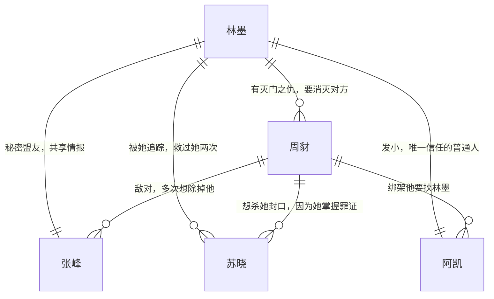

# 《黑暗骑士》角色档案

## 一、核心角色信息表

| 角色名 | 身份              | 年龄 | 性格                                         | 核心诉求                                   | 标签                                                                 |
| ------ | ----------------- | ---- | -------------------------------------------- | ------------------------------------------ | -------------------------------------------------------------------- |
| 林墨   | 黑暗骑士/前富二代 | 28   | 冷峻寡言、意志力极强、有道德底线、正义感极强 | 为家人复仇、打破沧城的黑暗体系             | 戴蝙蝠面具、格斗术顶尖、智商极高、不杀无辜                           |
| 周豺   | 豺狼帮帮主        | 45   | 心狠手辣、狂妄嚣张、视人命如草芥、极度贪婪   | 掌控沧城所有黑色产业、除掉所有反对自己的人 | 刀疤脸、左手戴金表、养了一群亡命之徒、背后有官员保护伞               |
| 张峰   | 刑侦队队长        | 48   | 正直隐忍、心思缜密、信仰程序正义             | 将周豺团伙绳之以法、还沧城司法公正         | 不与腐败警察同流合污、暗中给黑暗骑士递消息、当年林墨家灭门案的负责人 |
| 苏晓   | 调查记者          | 26   | 勇敢执着、有正义感、不怕危险                 | 曝光豺狼帮的罪证、让民众知道真相           | 一直追踪黑暗骑士的新闻、被黑暗骑士救过两次                           |
| 阿凯   | 林墨发小          | 28   | 重情重义、性格直爽                           | 保护林墨的身份、帮他完成复仇计划           | 唯一知道林墨就是黑暗骑士的普通人、开了一个修车铺掩护林墨的行动       |

## 二、角色关系图

## 三、角色弧线设计

### 林墨（黑暗骑士）

1. 初始状态：三年前家人被杀后活下来，一心只想复仇，对城市的正义不抱希望，只想要周豺的命
2. 发展阶段：看到越来越多普通人被周豺迫害，意识到自己的责任不只是复仇，更是要打破整个黑暗体系
3. 高潮转折：阿凯被绑架，周豺要炸商场威胁全城，林墨意识到只有牺牲自己才能彻底解决问题
4. 最终结局：抱着周豺跳楼同归于尽，用自己的死换来了中央督导组的介入，彻底清除了沧城的黑恶势力

### 周豺

1. 初始状态：只手遮天，掌控沧城所有黑色产业，官员和警察都要看他脸色行事，不把任何人放在眼里
2. 发展阶段：黑暗骑士接连毁掉他的生意，杀了他不少手下，他开始疯狂报复，悬赏一千万买黑暗骑士的人头
3. 高潮转折：查到黑暗骑士就是当年自己漏杀的林墨，于是绑架阿凯，要把林墨引出来赶尽杀绝
4. 最终结局：被林墨抱着从百米高楼跳下，当场死亡，所有产业被查封，背后的保护伞全部落网

### 张峰

1. 初始状态：被周豺打压，空有正义感却无力对抗整个腐败体系，只能暗中收集证据
2. 发展阶段：发现黑暗骑士的存在，开始暗中给他提供情报，两人配合打掉周豺多个窝点
3. 高潮转折：知道林墨要和周豺同归于尽，想要阻止却来不及，只能带着警察赶到现场收尾
4. 最终结局：作为扫黑英雄受到表彰，把林墨的事迹上报，让他的牺牲没有白费
